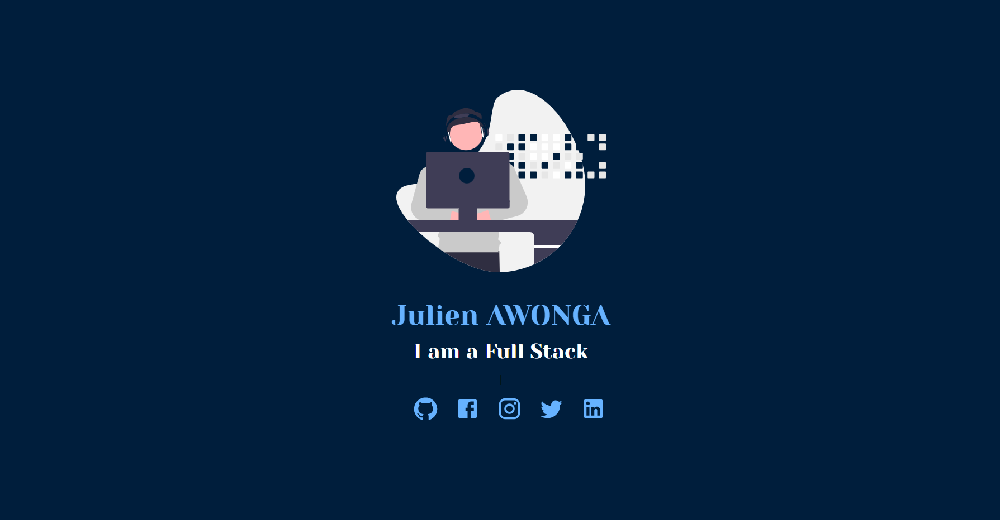

# My personal Website

Link to preview [Here](https://julienaw.me)

## Screenshots

## Technologies use :

* React
* Material UI

## To run the application

  1. Clone the repository
    * git clone [Copy this link](www.github.com/julienaw/personalweb)

  Run this command to install the dependencies needed
  2. ``` npm install ```

    Then you can run the application with this command
  3. ``npm start``

    Enjoy !!
  4. Like this repository

## License
 Free of charge, no license required.